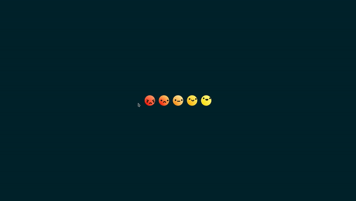
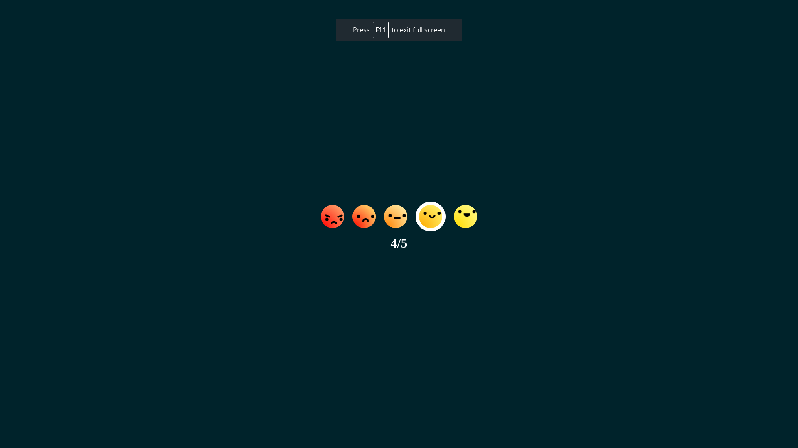
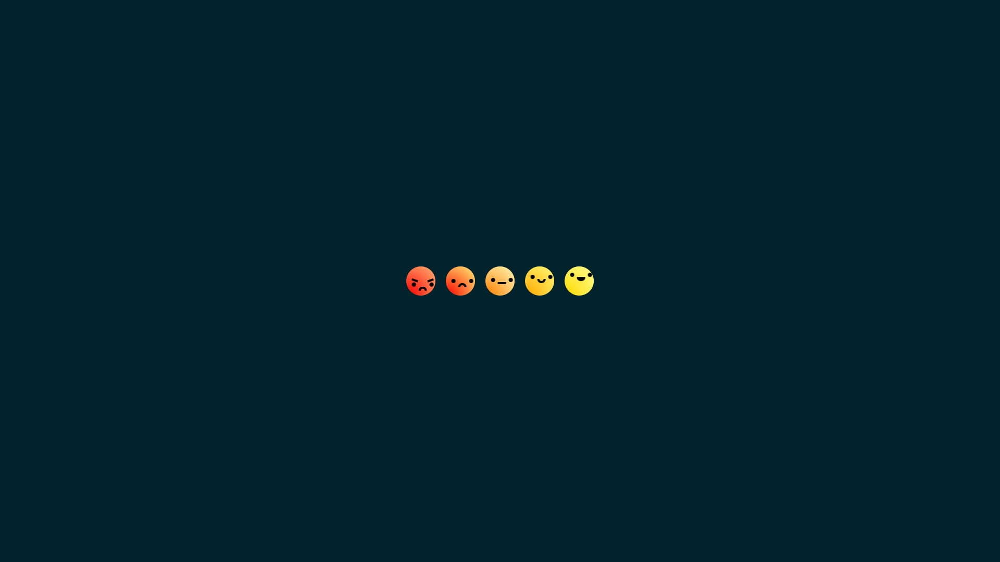

# BastiUi Challenge

This project is a challenge inspired by a YouTuber's video. The aim is to recreate a specific result or task demonstrated in the video.

## Result





## YouTube Video

Watch the original YouTuber's video [here](https://youtu.be/NIz7EiyunmY) to understand the challenge and get more context.

## Installation

1. Clone the repository:

```bash
git clone https://github.com/Andduril/BastiUi-Challenge.git
```

2. Navigate to the project directory:

```bash
cd BastiUi-Challenge
```

3. Install the dependencies:

```bash
yarn install
```

## Usage

To run the application, execute the following command:

```bash
yarn dev
```

go to http://localhost:5173 to see the result.